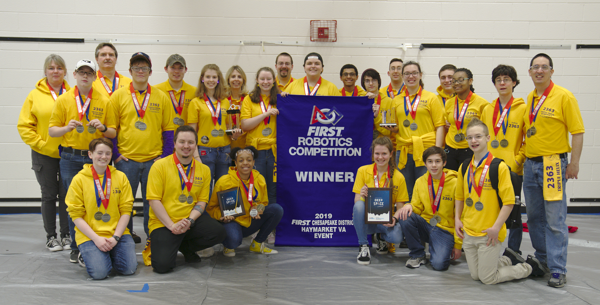

Triple Helix returned victorious last night, having won the FIRST Chesapeake District - Haymarket VA event along with partners 612 and 1731!  After ranking 5th after qualification rounds, we entered eliminations prepared to face a tough battle against great opponents.  Our robot Genome Lambda is technically ambitious, making use of several electromechanical & controls techniques right there on the cutting edge, and we discovered several areas of improvement via an iterative break & repair cycle completed many times over the course of the 2-day event.  We took every eliminations round to 3 matches, finally besting the 2nd-ranked alliance with TWO one-point wins in the final matches, for the hard-fought event win.  It all couldn't possibly have been more dramatic!

We were also awarded the Engineering Inspiration Award, FIRST's 2nd-highest honor.  A Texas team that we look up to said recently that they consider EI the "most important award in FRC as it shows you are working in your community to spread STEM in effective ways."  Here's what the judges had to say about us:

*The Engineering Inspiration Award celebrates outstanding success in advancing respect and appreciation for engineering within a team's community. Inspiring others to respect science and technology requires passion, knowledge, and commitment. FIRST celebrates these qualities by presenting its Engineering Inspiration Award. This team embraces the FIRST principle of creating an inclusive space for all. To democratize STEAM, they have turned to YouTube, opened a makerspace, and encouraged all ages to join their team. This team has brains, drive, and passion... which makes them a triple threat. Qualifying to compete for the Engineering Inspiration Award at District Championship, Team 2363!*

With this win and award, the team has clinched our berth at the District Championship at GMU in early April.  We're also probably about 60% of the way to punching our ticket to the FIRST Championship in Detroit in late April.

The team is now preparing for our next event, March 16-17 at Churchland HS in Portsmouth.  We invite everyone to come visit the event to cheer us on!

Nate
