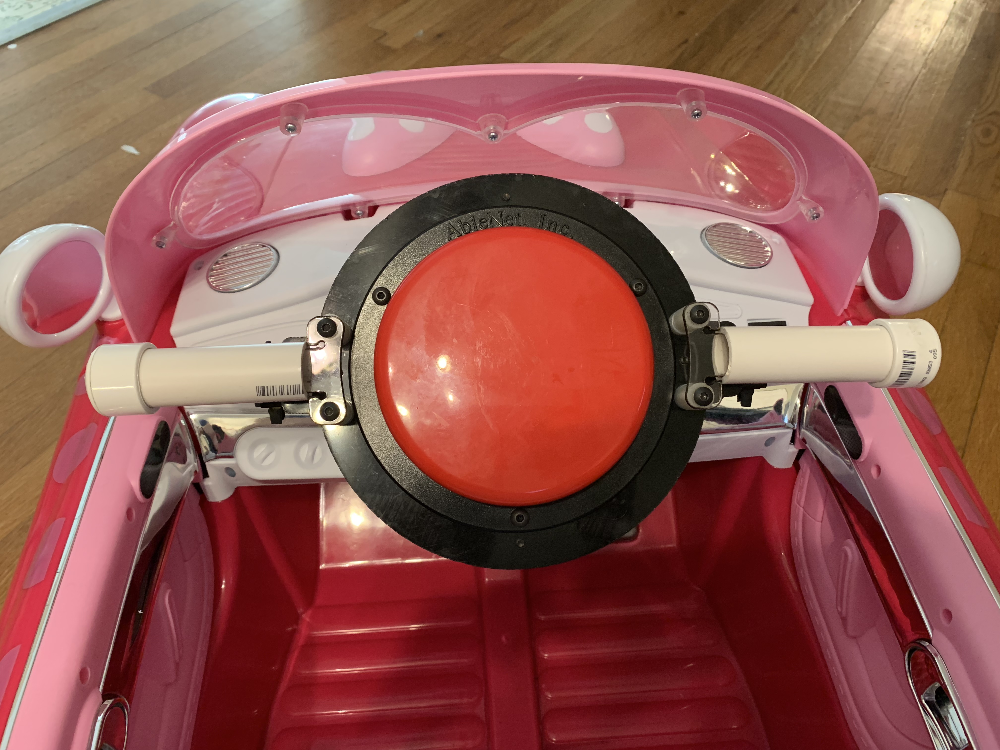
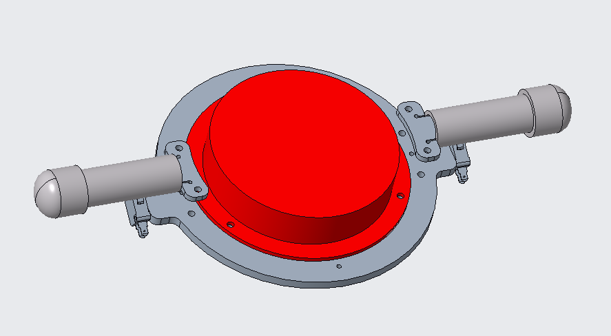

This spring, Triple Helix partnered with an occupational therapy doctoral student from Virginia Commonwealth University to develop assistive devices for people in the Hampton Roads region. Through communication with the Children’s Assistive Technology Service (CATS) a need was identified for a modified ride-on toy car, based on the University of Delaware’s [GoBabyGo project](https://sites.udel.edu/gobabygo). This project aims to provide access to low-cost mobility devices for young children without other means of exploring their environment. In this case, the recipient was a young girl who does not have the ability to move her lower extremities as a result of a birth defect.

To provide access to the car’s controls, a 5-inch switch was mounted on the steering column and wired via a relay switch to the car’s motor to replace the foot pedal function. Additionally, PVC handles were added on each side of the center switch for more ergonomic steering control. To also allow for simultaneous propulsion and steering, the handles fit over a laser-cut Lexan frame which, when flexed, activate an additional limit switch on each side of the steering column. This design concept can be applied to other ride-on cars, depending on a particular child’s needs and functional abilities.

