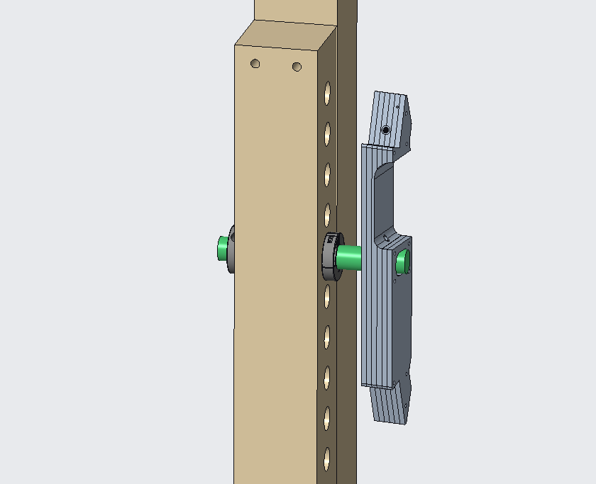

This spring, Triple Helix once again partnered with a Virginia Commonwealth University occupational therapy doctoral student to develop assistive devices for people in the Hampton Roads region. The team created this accessible bow mount for [Camp Bruce McCoy](https://www.biav.net/camp/), a residential summer camp for adults with a brain injury in Chesapeake, Virginia.  This device will enable single-arm operation of a recurve bow which will be mounted in the shooting gallery at the camp.  The team provided both right-handed and left-handed versions of the bow mount to the camp.

The bow mount is fabricated from laminated sheets of 1/4" clear polycarbonate.  Triple Helix cuts this material on our 80-watt laser cutter, but these parts can alternatively be fabricated with more common shop tools (e.g. jigsaw, hand drill).  The bow mount enables the user to aim the bow in both the azimuth and elevation directions before shooting an arrow.  The bow can be installed at any height, enabling archery practice for both standing and seated users.

