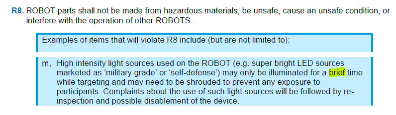
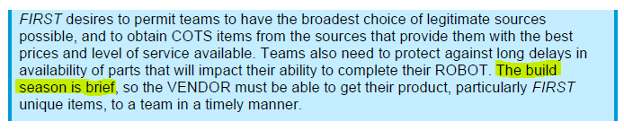

Triple Helix's 2019 robot used vision systems to target the retroflectors which were attached to various scoring locations around the field. Throughout that season, we struggled to find a way to use these vision systems without triggering the objection of nearby field volunteers, who found them to be too bright.

In February 2020, Triple Helix mentors posed a question in the official Q&A seeking a definition of the word "brief" as it appeared in the blue box below rule R8:

The question was deleted from the Q&A system soon after it was posted.

Our question, the original text of which is lost, was a non sequitur. We proposed the fanciful idea that since the manual describes the January-March build season as "brief" in a completely separate discussion of Vendor qualifications, then it must be acceptable to illuminate a high-intensity light for no longer than 3 months at a time.

The following email conversation tells the story of that deleted question.  We share this conversation here because we think it remains an informative look into the thought processes of both the game designers and the players.

Hello Team 2363!

My name is Jamee Luce, and I am the Team Advocate for FIRST Robotics Competition. I’m writing to you today in regards to Question 309, one of the questions your team submitted to the official Q&A system.

Writing the FIRST Robotics Competition Manual is one of the most important, but most difficult, things we do as the Game Design Team. We try to balance its readability with the necessity to be very specific. This gets very challenging for us at times. As such, there are times when we use the same words to mean very different things.

In your question, the word “brief” is used in this way. In one instance of “brief”, we wanted to provide guidance to teams about how to appropriately use their vision tracking system, and in another, we used “brief” to describe the length of the build season.

We find the comparison of these two situations to be inappropriate, since most users will understand that we didn’t mean the same time frame in both instances. As authors of the manual, we need to be able to express ourselves in different ways, depending on the situation. In some cases, it’s imperative that we are very specific (how long can a team be pinned), but in others, we don’t believe our community needs that kind of specifics (have your light on for a brief period of time).

We have deleted your question, and we ask that your team please think about your questions and how it reflects on our community before your team posts again. Please remember that we are all members of this community together. Most of us are coaches and mentors ourselves, so we really do think about the manual in its entirety before we publish.

Thanks!

Jamee Luce, Team Advocate, FIRST ® Robotics Competition

Jamee, I appreciate your note and understand the group's decision to delete the question. Thank you for personally reaching out to explain things.

I'm sorry the question was received as being inappropriate and caused you to see our team as not having a respect for the hard work of the team of manual writers. We think the GDC is doing a stellar job crafting FRC rulesets that are both clear and internally consistent. We do appreciate how exceedingly hard this is to do! Triple Helix has a deep love of high-quality documentation. We can point to the fact that there have been only a very small number of significant rule changes made this year in the Team Updates as evidence that the 2020 rules are largely well done. We also especially appreciated the decision to pre-release some limited rules sections prior to the start of the season, as this gave us time during the offseason to ponder over the implications of the 2020 bag day changes.

We are dedicated members of this community and are committed to the program's effectiveness, especially in our local area. When we ask questions about the program, it comes from a place of wanting the program to be even better. When it comes to the particular issue we asked about in Q309, please understand that:

- Our team has a history with the limitations posed by the current manual language, at least as interpreted by the LRIs at our events:https://www.chiefdelphi.com/t/limelights-work-great-but-are-a-little-bright/350766
- We find that the potential for harm comes from a multiplication of two factors: intensity * exposure. As we do not currently have a method of controlling the light intensity, our strategy for mitigating risk relies primarily on reducing the 2nd factor in this equation, exposure. Ideally we can reduce exposure across both the space and time axes, by both (1) pointing targeting lights away from the eyes of field bystanders and (2) only lighting up the targeting lights while targeting the retroreflective vision target.https://www.chiefdelphi.com/t/limelights-work-great-but-are-a-little-bright/350766/31
- Although this mitigation strategy was successful in 2019, we are concerned that it will not be enough in 2020, given that:a. The goal is located above the opposing alliance’s driver station, putting the opposing alliance directly in the field of view of targeting lights. This takes away our ability to mitigate exposure on the space axis, leaving the time axis as our sole focus.b. It is reasonable for an alliance to be attempting shots on goal throughout most of the match.c. Even if not attempting shots on goal, it is reasonable to use lights and computer vision to employ the retroreflective target as one element of a field-relative positioning system throughout the entire match.https://www.chiefdelphi.com/t/anti-limelight-glasses-for-drive-team/371265/35
- We only sought GDC feedback after engaging with our community to the best of our ability. The origins of Q309 were in a discussion with Kevin Genson, the Senior LRI for FIRST Chesapeake, who wrote yesterday in a space for FIRST Chesapeake mentors:Hey everyone, just a reminder that the output of the Limelight cameras is very bright and can potentially run afoul of R8. On a recent LRI call there were a few examples of teams using the Limelight at full power and running it constantly during the entire length of the match. Please do not do this, as the moment someone complains about the brightness inspectors will be obligated to examine the light and may require mitigation. The best approach is to control the light via software. Ideally the light should only be used when targeting is happening; when the robot is facing the goal and you're in the process of seeking the reflective strips. The Limelight software includes a lot of options and flexibility.
- Even if Q309 had been answered, we think it is unlikely this issue would be completely resolved, and we have a number of remaining questions about how brightness of lights will be managed in the 2020 season. For example:a. How can we help inspectors & field volunteers distinguish low-intensity lights from high-intensity lights on our robot?b. Are high-intensity lights legal if they are used (however briefly) for the purpose of locating the robot in 2D space instead of aiming a shot on goal?

In the future, how can we seek answers to these questions in a way that will demonstrate both (1) our respect for the large community of staff, volunteers, and players who make FRC work in a way that provides stellar experiences for our students and (2) our desire to seek improvements to relatively narrow aspects of the program that we believe could be improved to create even better experiences for our students?

Maintaining the important core mindset that we are all in this community together, would you agree with the idea that "the moment someone complains about the brightness inspectors will be obligated to examine the light and may require mitigation"? Do all types of complaints carry equal weight? If so, do you think teams using bright targeting lights are at risk of drawing any bad-faith complaints from opponent teams who would like to see these lights be shut off, but do not have a safety concern?

Are there ways to improve the safety of our robot lighting that you recommend we should consider?

Thank you and have a good weekend,
Nate Laverdure
cc: Triple Helix mentors

Hi Nate and Team 2363.

Thank you for your thoughtful response. It is really helpful to understand that your question comes from a place of genuine question.

I will share this with our Game Design Team and I will get back to you next week. We have our Team Update meetings on Mondays, so it will be after that.

If you have any other questions or concerns before then (or about anything else), please don’t hesitate to reach out.

Jamee

Hi Nate.

I just wanted to follow up again on this email. With the suspension of the season, we will be reviewing the questions and suggestions below for future manuals.

I hope you and your team are doing okay in this very challenging time.

If you have any other questions or concerns, please don’t hesitate to reach out.

Jamee
