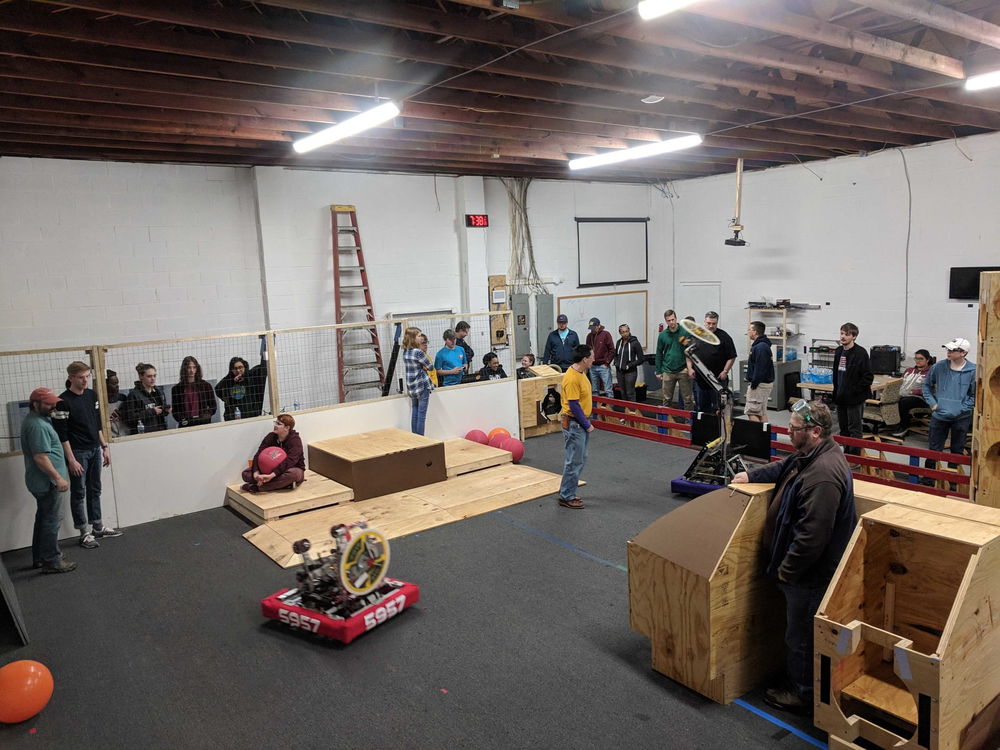
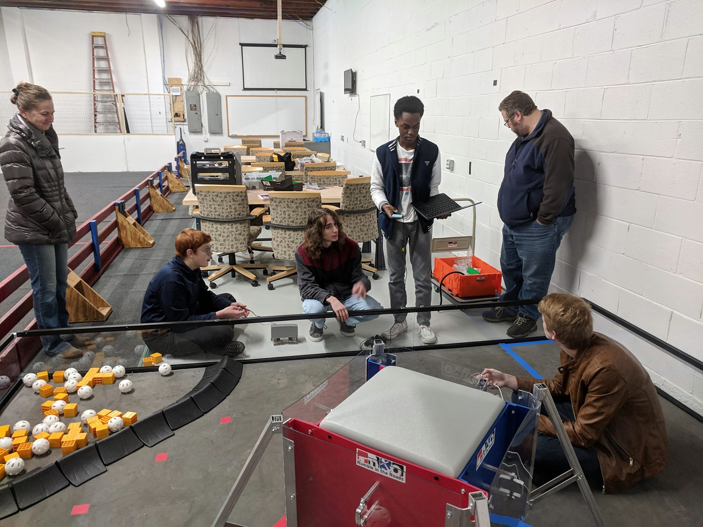

Menchville High School's competitive robotics team [Triple Helix](/) competes in [a STEM sport](https://www.firstinspires.org/robotics/frc) where the shape and structure of the official playing field changes each year.  Prior to [establishing the Peninsula STEM Gym in fall 2018](/publications/2018-09-23-press-release-peninsula-stem-gym-provides-practice-opportunities-for-hampton-roads-youth-robotics-teams/), the team's first opportunity each season to see & touch the playing field was when the team arrived at their first tournament of the year.  (Imagine playing an athletic sport competitively without the benefit of practicing on a court!)

Since that time, the Peninsula STEM Gym in central Newport News has offered local student robotics teams a 2,500 square foot practice area for testing robot functionality and improving their game. The facility has enabled teams to gain driving practice, discover ways to iterate and improve their robot designs, and better prepare to compete against other top Virginia teams as well as on the world stage.

A place for student robotics teams to develop competition robots and have real-world engineering experiences that will inspire a lifelong interest in science and math, the STEM Gym provides an indispensable service for the students of the Peninsula.

**Triple Helix Robotics and our supporting nonprofit organization Intentional Innovation Foundation is now seeking a new home for the STEM Gym**, and we ask for your help in identifying suitable locations.

## STEM Gym location requirements

- Situated on the Peninsula
- 30x75 FT flat and level open space without columns or other interruptions
- 12 FT minimum ceiling height, ideally higher
- Accessible by any local youth STEM team who would like to use it for practice
- Accessible at all hours (especially evenings and weekends) with little advance notice
- Availability of 110VAC power & internet

Nice-to-haves, that would be an improvement over the STEM Gym's current location, include:

- Heat
- Parking
- Standard dock-height loading dock 

## STEM Gym highlights

In addition to serving as the [main practice space for Triple Helix Robotics](https://www.youtube.com/watch?v=3uduSFJzkjE), the STEM Gym provided a gathering and testing location for Newport News and Hampton City Schools competitive robotics teams on [more than 27 occasions](/publications/2020-01-13-outreach-event-log/) in calendar year 2019.

During summer 2019, the STEM Gym served as the home base for a [unique collaboration between local teams](https://www.jlab.org/news/releases/robotics-team-lends-arm-police) who [met weekly to prototype a mobile target robot](https://www.13newsnow.com/article/news/local/mycity/newport-news/newport-news-police-department-partners-with-robotics-students/291-7dcd8f62-bc33-4202-8ac5-27ffc1005b7f) for the Newport News Police Department shooting range.

The STEM Gym is itself collaborative project, too. A [Community Knights](https://communityknights.org/) GIFT Grant amplified [Triple Helix's existing funding](/partners/) and enabled the team to establish the facility. Newport News Shipbuilding generously donated the full-size FTC field border and the first set of FRC game elements. The NASA Knights, FRC team 122, contributed much of the lumber that was used to fashion full-scale wooden mockups of the FRC game elements for the past two seasons.

The STEM Gym also hosted an FLL Kick-off event, which provided local teams an opportunity to review the playing field, discuss game rules and robot design options, and speak to three local professionals about their areas of expertise relevant to the FLL research project.

Thank you, 
Nate Laverdure 
President, Intentional Innovation Foundation 
Head coach, Triple Helix Robotics
