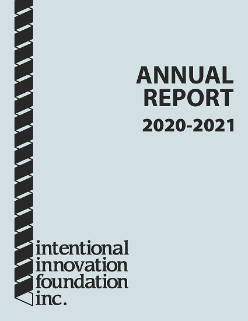

**With just 2 months to go until kickoff of the 2022 FIRST Robotics Competition, we look back on a year that-- despite its hardships-- was also full of improbable victories.**

Intentional Innovation Foundation, the nonprofit operating sponsor for Menchville High School's Triple Helix Robotics team, has published our [annual report](/publications/2021-10-29-2020-2021-annual-report/) for the July 2020 - June 2021 fiscal year.

The report captures the many stellar recent accomplishments of our flagship competitive youth STEM program:

- We developed a FPV quadcopter build-fly-compete challenge and provided kits to 21+ participants
- We competed in FIRST's Infinite Recharge at Home series of challenges and posted the best scores in the Virginia/Maryland/DC region
- We presented the graduate-level techniques we've used to generate and follow time-optimized 2D paths

**Triple Helix appreciates [our gracious sponsors](/partners/) who make our award-winning program possible, and we look forward to an even more impressive 2022!**

[Join our team](/publications/2021-07-07-be-a-mentor-for-triple-helix-robotics/) - [Donate](https://www.paypal.com/fundraiser/charity/1879071) - [Donate in-kind](/publications/2019-09-20-in-kind-donation-most-wanted-list/)

-- 
Nate Laverdure 
President, Intentional Innovation Foundation 
Head coach, Triple Helix Robotics
