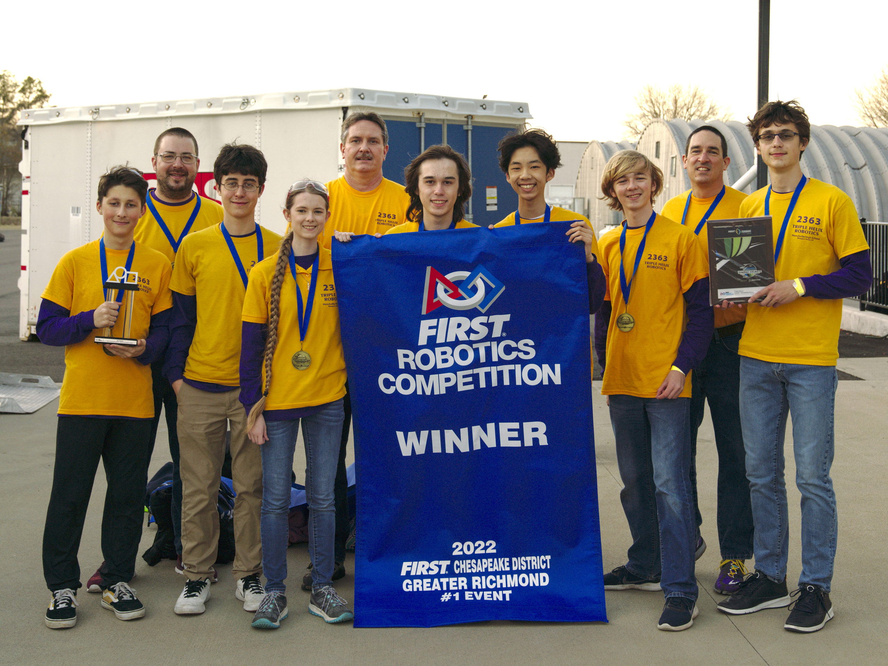

Triple Helix traveled to Colonial Heights this weekend where we competed against 17 other FRC teams from Virginia. The team ranked first in qualification rounds, captained the #1 alliance, and won the event alongside high-performing partner teams 5724 and 3136.

We're thankful to the support of our [partners and sponsors](http://team2363.org/partners/), the families of our team members, and our excellent remote scouting team. Our competitive success this weekend stemmed from our unique preparedness, which was only possible due to your support.

Triple Helix competes again in 2 weeks, as we work to clinch a berth at the FIRST Chesapeake District Championship at the Hampton Coliseum on April 7-9, 2022.
You can follow our season at [thebluealliance.com/team/2363](https://www.thebluealliance.com/team/2363) and watch our events streamed live at [twitch.tv/firstchesapeake](http://twitch.tv/firstchesapeake).

-- 
Nate Laverdure 
Head coach, Triple Helix Robotics
