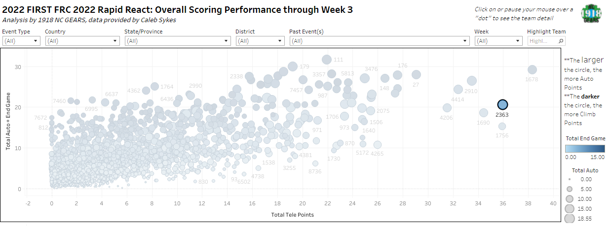
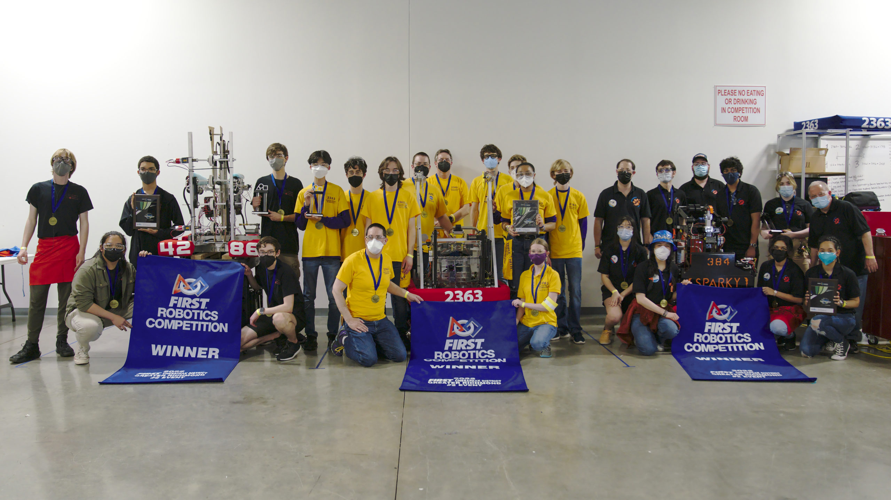
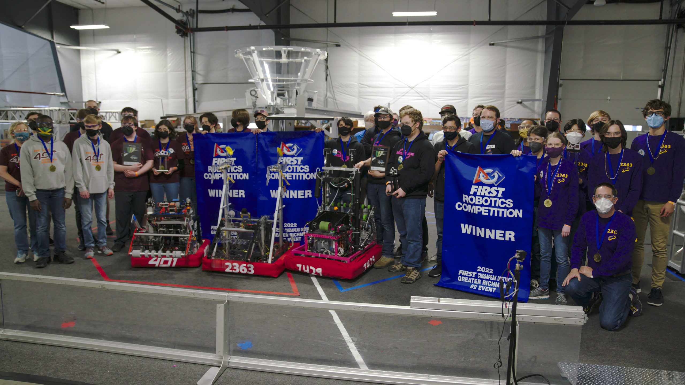

This weekend, Triple Helix once again traveled to the Keystone Tractor Museum where we participated in two complete single-day tournaments with 18 different teams each day.  Both Saturday and Sunday contained the full experience of a traditional 2-3 FRC tournament, including travel to and from home, passing initial inspection with our robot, climbing (and falling) in the ranking throughout the competition rounds, forming a competitive alliance for the elimination rounds using insights from match scouting, and vying for ultimate victory as an alliance in the playoffs.

On Saturday, the team found victory alongside partner teams SPARKY 384 from Henrico and Imperial Robotics team 4286 from Mechanicsville. Triple Helix was ranked #1 at the conclusion of qualification rounds and captained the #1 seed alliance. **Triple Helix went undefeated in this event-- an amazing accomplishment.**

On Sunday, the level of competition was much higher. **We had been carrying an amazing 27-match win streak** until it was broken late in the qualifying rounds by a loss to our future alliance captain, team 401 Copperhead Robotics from Christiansburg VA. Triple Helix joined 401 and our 3rd partner team 7429 Convergence for a fight to the finals, where we won against our good friends at team 1610 in a series of 2 tough matches.

We have truly found world-class performance this year. By several metrics we are among the top 10 teams internationally.

[https://public.tableau.com/app/profile/1918firstroboticsscouting/viz/RapidReact2022/OverallViz](https://public.tableau.com/app/profile/1918firstroboticsscouting/viz/RapidReact2022/OverallViz)

With 38 official match wins already under our belt, we now set our sights squarely on the District Championship.  **We invite all our friends and supporters to join us at the event, which is open to the public on Friday and Saturday April 8-9.**  More information about the event can be found at [https://www.firstchesapeake.org/first-programs/frc/frc-events/frc-district-championship-event](https://www.firstchesapeake.org/first-programs/frc/frc-events/frc-district-championship-event)

*Nate Laverdure*
*Head coach, Triple Helix Robotics*
