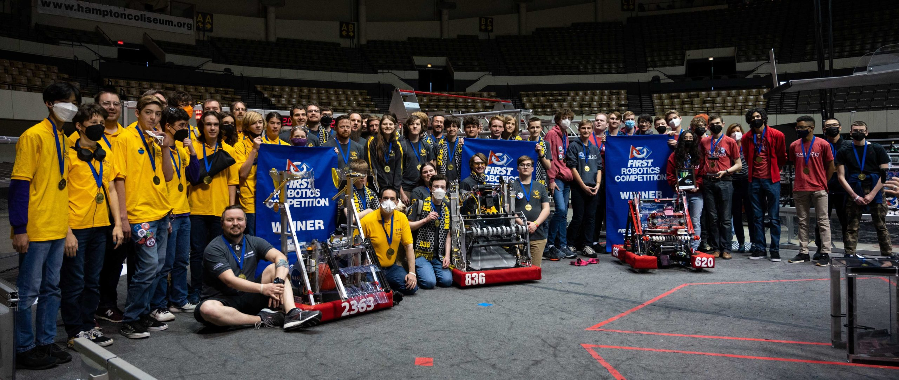

Yesterday evening, our Triple Helix robotics team was crowned winners of the FIRST Chesapeake District Championship held at the Hampton Coliseum, having competed against the 60 highest-ranked high school FIRST Robotics Competition teams in Virginia, Maryland, and DC.

Photo courtesy of Zach Clarke

Our #1 seeded alliance was captained by the RoboBees of Hollywood, MD and joined by partner team 620 Warbots of Vienna, VA. We didn't have an easy path to victory-- the playoff rounds of this event were the most nerve-wracking matches I have ever experienced in my 20 years of FRC.

Triple Helix finishes our 2022 regular season: 

- ranked #2 out of over 100 teams in our 3-state region,
- with a W-L-T record of 55-4-3,
- having acquired 4 of those precious blue "WINNER" banners (something only 3 other teams worldwide have done so far!), and
- having faced off against our friends 1610 an unfortunate (and perhaps record breaking?) 3 times in the final rounds of a tournament

In addition to our outstanding performance as a team, our team members were recognized individually as well:

- Our lead programming student (and at this event, our human player!) Joshua Nichols was selected as one of the three Dean's List Finalists to represent FIRST Chesapeake on the world level. We're so incredibly proud of Josh and the work he has done over a period of 9+ years to not only increase visibility and respect for STEM in his community, but also to create real STEM exploration opportunities for those who need it. Read our nominating essay, written by the team mentors, [here](/publications/2022-02-10-deans-list-2022-joshua-n/).
- Our mentor Chris Garrity was recognized as one of the mentors nominated for the Woodie Flowers Finalist Award, which celebrates effective communication in the art and science of engineering and design. Chris is not only a core mentor for Triple Helix but he's also a reliable event volunteer who makes our competition season possible. Read our nominating essay, written by the team students, [here](/publications/2022-04-03-woodie-flowers-2022-chris-garrity/).

There are so many amazing stories to share from this event and from this season. Stories about struggle, sacrifice, mistakes, bad fortune, good fortune, commitment, skill, resilience, and reward. Our team members will carry these experiences with them for the rest of their lives.

Sometimes in this community we hear the phrases ["More than robots"](https://www.youtube.com/watch?v=AjIISbARc20) and "It's not about the robot" and even ["This isn't a robot"](https://www.youtube.com/watch?v=hpEWBmdL0Ow). These things certainly capture a great realization-- that our program is about using the robot to build better people, not about using people to build better robots. But if you jump directly to this logical endpoint, and you don't come to it after first [falling for the Randy Pausch-style "head fake"](https://www.youtube.com/watch?v=ji5_MqicxSo), I worry that the big impact of this realization can be lost. I warn people from taking this shortcut, because I've felt that it's so much more rewarding if you take the longer road to understanding. This is why, as a team, we can take the attitude that *It Is About The Robot*... it's because "the robot" is enough. "The robot" can encapsulate all of the things-- the hard-won lessons about sportsmanship, perseverance, honesty, ability, and being a member of a team. The head fake is important; "the robot" is important.

On all of those intertwined levels of understanding-- man, our team's robot this year has been a really great one.

We cannot be more grateful to our entire network of stakeholders for what they do to enable our success. I hope that every parent, sponsor, school administrator, alumni, and friend of the team who receives this message can feel they share in our victory. Your belief in our mission, and your partnership, is essential. Thank you.

The team is taking a couple days off. On Tuesday, our post-season starts. We'd really like you to be a part of it!

-- 
Nate Laverdure 
Head coach, Triple Helix Robotics
