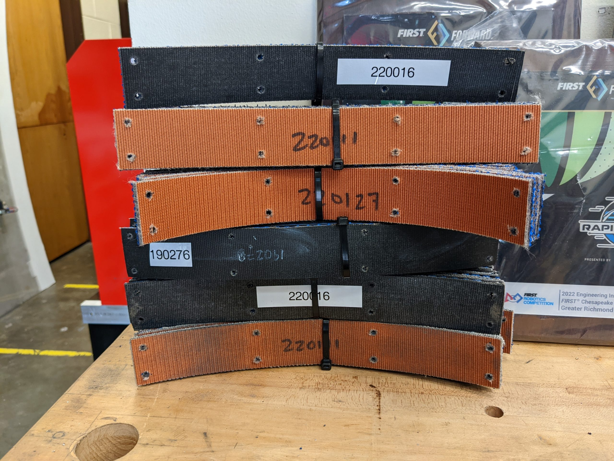

Triple Helix designed and fabricated a set of drilling jigs to prepare replacement strips of treads for the Swerve Drive Specialties MK4 and MK4i swerve module. These jigs reproduce the hole spacing for black neoprene and blue nitrile tread material [shared by SDS's Patrick Woolfenden here](https://www.chiefdelphi.com/t/black-neoprene-vs-blue-nitrile-tread/408365/21); treads prepared using these tools install tightly on the nominal 4" diameter x 1.5" wide MK4 swerve wheel. Triple Helix used our 130W laser cutter to cut the components of the tread tools from 1/4" Delrin sheet.

[Onshape document](https://cad.onshape.com/documents/779cf89001e8898b805b9f17/w/d1a90362508aa4b26c90cc80/e/01b79c3aea028901920abecb?renderMode=0&uiState=628e438a7b7cfe4ef1fdab32)

Assembly instructions:

- Laser cut the top and bottom plates from 1/4" sheet.

- Laser cut the spacer plate(s) to match the thickness of the tread material.

- Drill and tap the holes around the perimeter of the bottom plate to 8-32.

- Drill the corresponding holes on the other 2 plates to provide clearance for an 8-32 fastener.

- Install drill bushings (McMaster 96511A666) into the top plate such that they are flush with the lower surface.

- Assemble the drill jig with SHCS 8-32 x 5/8" LG fasteners.

