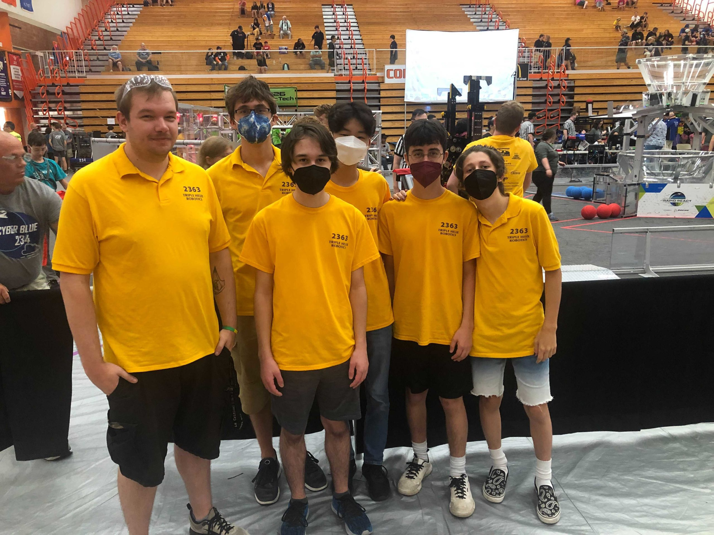

This summer, Menchville High School's award-winning Triple Helix robotics team travels to two high-profile offseason tournaments where we compete (for fun and bragging rights) on a national stage against many of the world's top teams.

These events are similar (in size, scope, schedule, budget, etc.) to our own ["Rumble in the Roads"](https://www.rumbleintheroads.com/), a fall FRC offseason tournament that Triple Helix co-hosts alongside our friends 1610 Blackwater Robotics. This fall, the 7th annual Rumble will be held at Menchville High School on Saturday November 5.

## Indiana Robotics Invitational (IRI)

Last weekend, we traveled to the prestigious [Indiana Robotics Invitational](http://indianaroboticsinvitational.org/), a 48 team tournament held over 2 days in Columbus, Indiana.

After successfully debugging a tricky networking problem on the evening of load-in, Triple Helix managed to squeeze out 7 wins in our first 11 qualification matches, demonstrating our robot's ability to quickly cycle game pieces into the large central goal and, right at the end of each match, quickly hang on the "mid" bar for some critical extra bonus points.

[Check out this 10-minute summary of the IRI by FIRST Updates Now!](https://www.youtube.com/watch?v=2F334KJ_Mzo)

Triple Helix was selected as the 4th and final member of the 4th-seeded alliance alongside world-renowned partners:

- 195 CyberKnights from Southington, CT
- 67 The HOT Team from Highland, MI
- 2539 Krypton Cougars from Palmyra, PA

Our 4th seeded alliance paired up against an extremely strong 5th seed in the first round of the playoffs (a best of 3 series), and ultimately lost to them in our 3rd and final match of the event.

This success -- 

- to receive an invite to this amazing event
- to be able to go
- to put up a winning record in qualifying rounds
- to be asked to join a playoff alliance
- for our robot to touch the carpet and put points on the scoreboard in the elimination rounds

-- represents the culmination of an amazing 2022 season for Triple Helix and is a massive honor for our team.

## West Virginia Robotics Xtreme (WVRoX)

In 2 weeks, Triple Helix travels to Morgantown WV where we will play at [WVRoX](https://www.marsfirst.org/wvrox), a 26-hour overnight endurance competition.  We are really excited to play over 30 matches in a field of 24 great teams...

[Check out this 1-minute teaser for the event!](https://www.youtube.com/watch?v=gX0MCsIDB0s)

## Follow along

Our fans can follow along as we play at these events by monitoring
[https://www.thebluealliance.com/team/2363](https://www.thebluealliance.com/team/2363)

Also, while we're at an event, the link [watch.team2363.org](http://watch.team2363.org/) should take you directly to a live stream of our matches.

Thanks for your support! 
Nate
