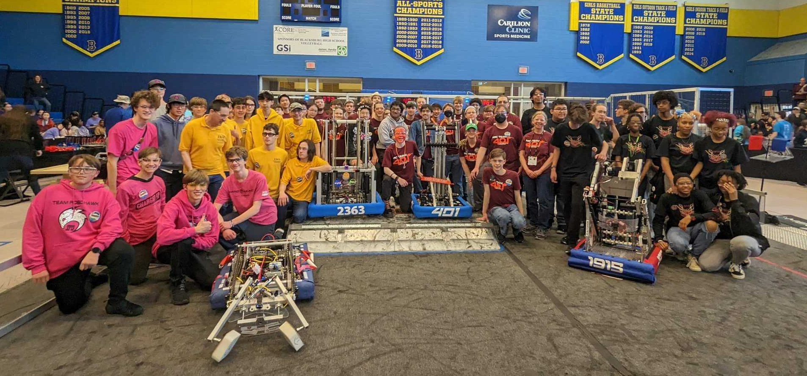
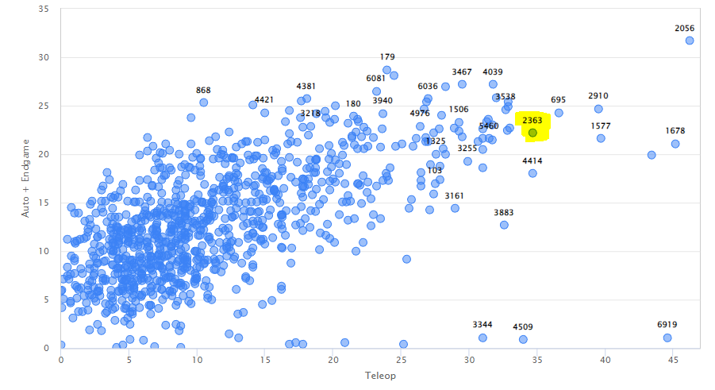

This weekend, Triple Helix Robotics traveled to Blacksburg for our first district qualifier event of the 2023 FIRST Robotics Competition season, and ***WON THE EVENT*** alongside partner teams 401, 1915, and 3373 against a field of 30 other contenders from VA, MD, and DC.

[*The winning alliance of four teams. Courtesy of 401.*]

Our robot "[Genome Xi](https://www.youtube.com/watch?v=PLql46E-GOo)" demonstrated reliable autonomous routines and highly polished teleoperated (student-driven) scoring throughout the event. In the qualification rounds, Triple Helix claimed an early lead and held onto our #1 ranking throughout the event, locking in our position as the captains of the #1 seed alliance.

[*Average points scored in auto + endgame (Y axis) and teleop (X axis) by all FRC teams worldwide as of the end of Week 1 of competition season. Via [statbotics.io/teams](https://www.statbotics.io/teams)*]

Triple Helix was also awarded the Autonomous Award for our technical leadership in translating [advanced control techniques](https://www.youtube.com/watch?v=hNm_9JbZ81M) into [points scored on the playing field](https://team2363.org/2023/02/genome-xi-2023-auto-modes/) during real matches. The judges said:

>The Autonomous Award sponsored by Ford celebrates the team that has demonstrated consistent, reliable, high-performance robot operation during autonomously managed actions. Evaluation is based on the robot's ability to sense its surroundings, position itself or onboard mechanisms appropriately, and execute tasks. Their triple-performing play impressed the judges. This team consistently scored two cones in autonomous. Control theory is in their genes!

Our stunning performance in this qualifier event means that we are very likely to punch a ticket to [the FIRST Chesapeake District Championship at George Mason University in Fairfax, VA on April 6-8](https://www.firstchesapeake.org/frc/first-chesapeake-district-championship-event/).

Fans of Triple Helix Robotics are invited to cheer us on at [our next qualifier, at Churchland High School in Portsmouth, VA on March 18-19](https://www.firstchesapeake.org/frc/portsmouth/). The event is open to the public on Saturday and Sunday. You can also watch the event steaming live at [watch.team2363.org](http://watch.team2363.org/), and dive into our stats at [thebluealliance.com/team/2363](https://www.thebluealliance.com/team/2363/2023).

Thanks to FIRST Chesapeake, the host team FRC 401 Copperhead Robotics, a really stellar crew of Triple Helix parents, and [all our wonderful sponsors](http://team2363.org/partners/) for making this weekend’s experience possible! We could not do this without your steadfast support.

– 
Nate Laverdure 
Head coach, Triple Helix Robotics
