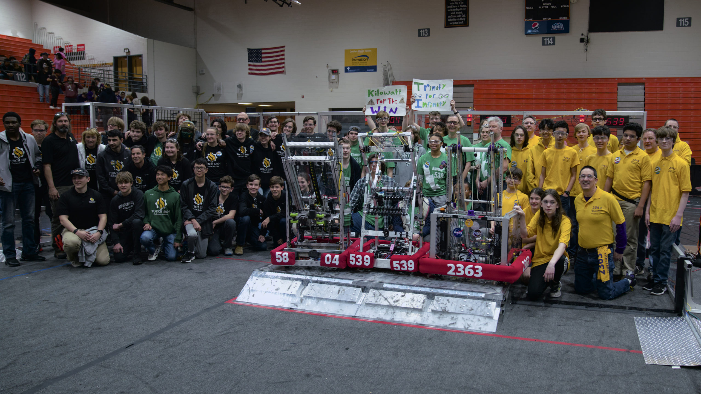

This weekend in Portsmouth, Triple Helix Robotics steamed to another victory on the FRC playing field, captaining our alliance of three teams to bring home our **6th win in a row in official play**. The team is now ranked #1 in Virginia, #1 in the Chesapeake District, #14 in the US, and #17 worldwide.

Triple Helix won the event alongside two alliance partners from Richmond: 5804 TORCH from the Collegiate School and, 539 Titan Robotics from Trinity Episcopal School.

The judges at the event also recognized Triple Helix with the Autonomous Award-- our second such honor this season! Owed greatly to our high performance in the autonomous mode, our win-loss-tie record now stands at 31-5-0 for the season.

The team greatly appreciated the strong support of our parents and friends at this event-- thanks to all the visitors who stopped by and wished us luck! We definitely needed it, as this event was by no means a cake walk. In addition to the exciting competition from several strong opponents, we struggled with a strange low-level software issue that sometimes caused our robot's processor to reboot mid-match. This issue even appeared in our finals matchup against the powerful #2 seed alliance captained by 3136 ORCA and featuring the heavy-hitting cone scorer 1599 Circuitree.

The team will be working on stomping this bug-- as well as continuing to reap the benefits of extensive practice with our robot at the Peninsula STEM Gym operated by Intentional Innovation Foundation-- as we prepare for the FIRST Chesapeake District Championship on April 5-8 in Fairfax, VA.

– 
Nate Laverdure 
Head coach, Triple Helix Robotics
