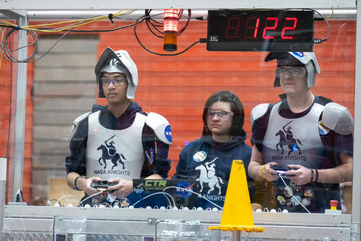
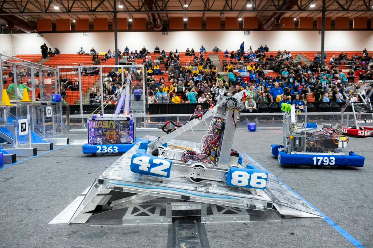
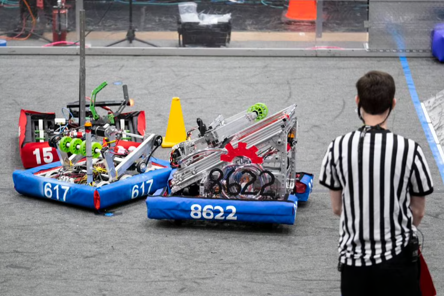

## Five teams of Hampton Roads students — and the robots they built — make playoffs during regional competition

By Gavin Stone
The Virginian-Pilot
Mar 20, 2023 at 6:34 pm

PORTSMOUTH — A small army of robots — built by teenagers — descended on Portsmouth this weekend to battle for supremacy.

Students from Hampton Roads were among 29 teams from the D.C.-Maryland-Virginia area who met at Churchland High School to duke it out in a game called Charged Up, which puts teams in a mock energy-storage scenario. This involves collecting cubes and cones, which are added to their respective “grids,” then balancing their robots on a charging platform before time runs out.

*Jacob Dizon, left, and Greyson Watts, right, pilot their robot while dressed as knights in the FIRST Robotics competition at Churchland High School in Portsmouth, Virginia on March 18, 2023. The team, NASA Knights, are based in Hampton, Virginia and are sponsored by NASA Langley Research Center. (Billy Schuerman/The Virginian-Pilot)*

Teams form alliances for each match and have to work together with students from other schools to win, and these partnerships benefit them in the playoffs when the top-performing teams get to pick who will join them. Students also take on the role of talent scouts, evaluating what their robots’ weaknesses are and identifying teams that can offset them for the best chance of winning.

This spirit of “coopertition” — a mashup of the words cooperation and competition — extends to the sharing of parts to help with repairs for damage sustained during matches, according to David Martin, a mentor for Royal Robotics of Portsmouth.

Of the seven Hampton Roads teams competing this weekend, five made the playoffs, with Triple Helix Robotics out of Menchville High School in Newport News leading the winning alliance in the final round. The teams that qualify for the district championship at George Mason University in April won’t be selected until after the next Charged Up event in Glenn Allen this weekend. All these events lead up to the world championship in Houston the weekend of April 19.

*The robot from team Imperial Robotics (4286) attempts to balance on the charging station before time expires, while Triple Helix's robot (back left) works on adding the cubes and cones to their grid, at the FIRST Robotics competition at Churchland High School in Portsmouth on March 18, 2023. (Billy Schuerman/The Virginian-Pilot)*

Each match starts with the robots operating autonomously for 15 seconds to try and score points. Then the students take over — often with a familiar Xbox controller — as chaos ensues. The robots frantically zoom around the playing field and smash into each other over and over while precisely guiding the cones and cubes into their grids.

The students have access to base code and guidelines for certain parts of their robots, but the majority of the construction is the work of the students themselves, Martin said. The students also determine their strategy.

The autonomous portion is where Triple Helix Robotics, which counts NASA among its sponsors, felt it could get out ahead of the competition early. The team’s autonomous performance ultimately won it the Autonomous Award given to the robot with the best ability to sense its surroundings, position itself and execute tasks on its own.

Triple Helix members honed their code at the STEM Gym in Newport News, where they can scrimmage other teams on a replica playing field similar to the one used this weekend, according to head coach Nate Laverdure. He explained that their robot was able to read the barcodes on the grids and use those to triangulate its location, count the rotations of the wheels and calculate its inertia — and use all these data points to guide the robot where it needs to go as accurately as possible.

“These kids are doing stuff that academic researchers are writing their Ph.D. theses on and people in industry are building companies around — there’s companies that are focused on solving exactly the same problems that we’re solving with high school students,” Laverdure said.

Jonathan Buszard, a junior in Triple Helix, said that engineering classwork can only take you so far.

“This is like you’re right in the thick of it, doing all the stuff you’re learning, doing new stuff all the time,” Buszard said.

Another NASA-sponsored team from Hampton Roads, the NASA Knights — a team out of New Horizons Regional Education Center in Hampton who were decked out in makeshift suits of armor — said they spent about 14 hours per week on their robot. Freshman Grace Walker said she put in a total of about 300 hours in their shop last year during the season and offseason.

“It was pretty much my second home,” Walker said. “I was like, ‘Oh I’m back here again, might as well build a robot.’”

Royal Robotics out of Churchland High School improved on its performance at the previous competition, during which it broke its robot’s claw almost immediately. This time it employed a simpler grabbing mechanism using a pneumatic system that simply squeezed two metal bars together, and worked out some new code for the autonomous portion that paid dividends on Sunday.

*Robots battle for rank at the FIRST Robotics competition at Churchland High School in Portsmouth on March 18, 2023. (Billy Schuerman/The Virginian-Pilot)*

Going into the weekend Royal Robotics wanted to have all three of its alliance’s robots balanced on the charge station, which is worth a lot of points because of the coordination it requires, but one of its allies’ robots knocked another ally’s robot off the charge station in the process, explained Ray Clause, a senior at Churchland High School and build captain. Clause said he tends to focus on gathering the cubes and stealing them from the other alliance when he can, “because that’s just the kind of person I am.”

Not only are students applying what they’ve learned in school and putting those concepts into action, they’re also learning complex social skills that will serve them later in life, Martin explained.

“It’s been very rewarding seeing the kids grow and just being able to learn stuff, some kids come in pretty shy, and getting them to open up — it’s been good,” Martin said. “We’ve had kids that come in who weren’t very social and by the end they’re still not super social but they at least do get more social, and that’s good to see.”

Chris Wilson, a sophomore at Churchland and the programmer for Royal Robotics, said he was completely uninitiated in basic physics concepts, but now he’s got a working knowledge of them.

“Two years ago when I first joined, when they were mentioning things like torque and force and centers of gravity — I didn’t know a thing,” Wilson said, “but now I’m like, ‘OK, I understand what stuff is and how it works.’”

Gavin Stone, 757-712-4806, gavin.stone@virginiamedia.com
