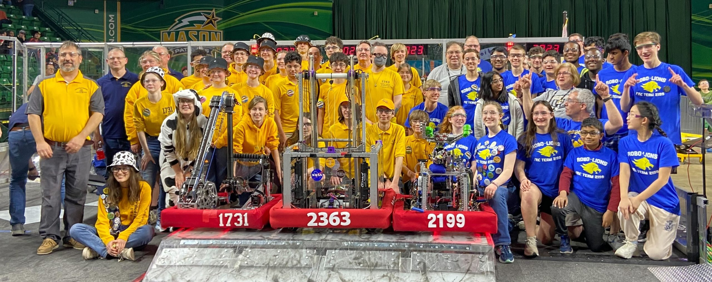
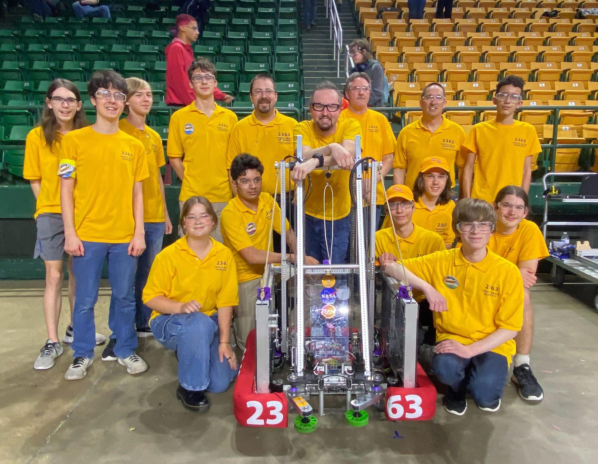

This weekend, Triple Helix Robotics successfully defended our title as Champions of the FIRST Chesapeake District and have [received an invite to compete at the World Championship in Houston, Texas!](https://www.gofundme.com/f/frc2363)

Triple Helix won the three-day District Championship event in Fairfax, Virginia, alongside our alliance partners FRC 1731 Fresta Valley Robotics Club from Warrenton, VA and FRC 2199 Robo-Lions from Finksburg, MD. The event featured the top 60 high school FRC teams from Virginia, Maryland, and DC. Over 135 matches were played to determine the winning alliance.

In our third elimination match, the 2nd-seeded 2363 - 1731 - 2199 alliance scored every available game piece and racked up an incredible 191 points, matching the world record high score for that phase of the tournament, and just shy of the maximum possible score of 193.

Triple Helix’s performance this year has qualified us to compete at the FIRST Championship, a post-season exposition of 600 high-performing teams from around the world. You can help us get to Worlds by contributing to our GoFundMe campaign at [https://www.gofundme.com/f/frc2363](https://www.gofundme.com/f/frc2363); your support will help offset the team’s transportation costs and is greatly appreciated.

The judge panel at the District Championship also recognized Triple Helix with the Innovation in Control Award, which celebrates innovative control techniques to achieve gameplay functions. Our controls innovations are the result of an intentional, multi-year, student-driven campaign to improve our understanding of autonomous navigation and computer vision processing, and it's through those student accomplishments that we’ve been able to capitalize on these developments to greatly enhance our competitiveness on the FRC playing field.

An enormous thank you to all who’ve made our 2023 season so successful– especially [our sponsors and donors](http://team2363.org/partners/) large & small as well as our mentors, families, and friends. Long-term competitiveness in this program depends so heavily on sense of community… dense networks of support… teams of teams of teams. We could not do it without you on our team. Thank you!

-- 
Nate Laverdure 
Head coach, Triple Helix Robotics
