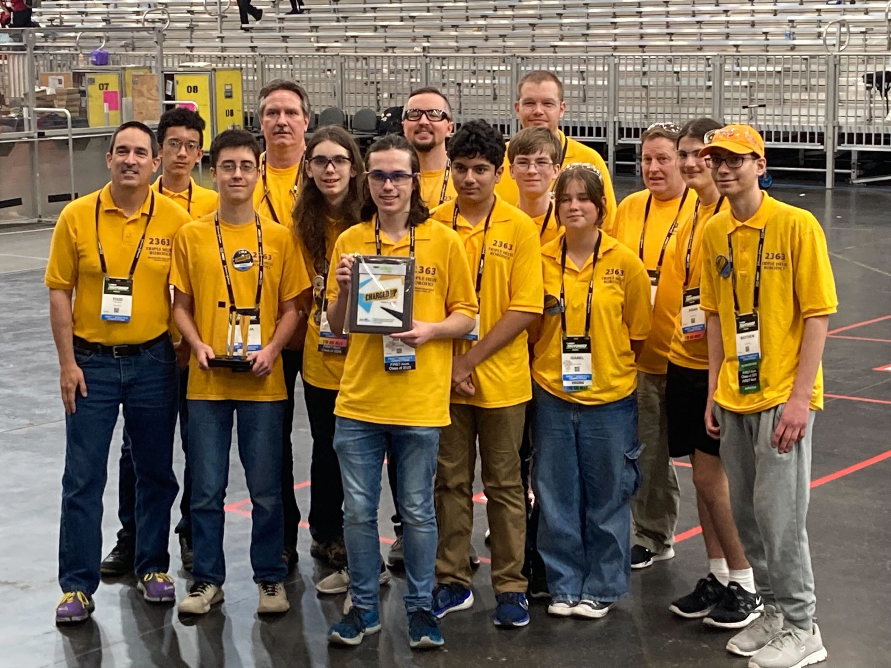
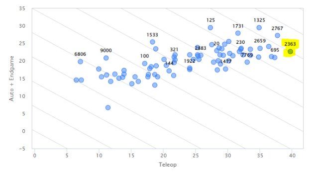
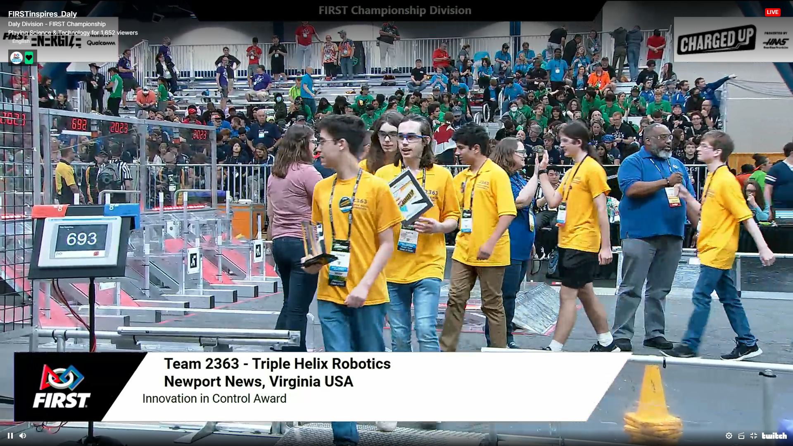
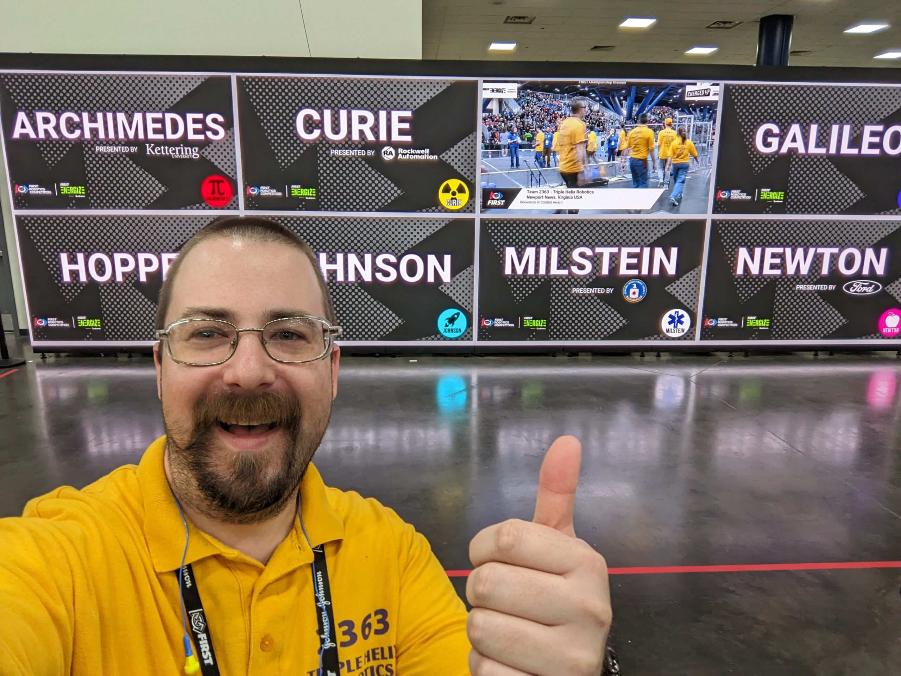

Triple Helix Robotics shares our heartfelt thanks for your incredible support of our record-breaking 2023 FIRST Robotics Competition season!

Late last night, the team returned from our trip to the international FIRST Championship in Houston, Texas, where we met over 600 other high school teams from all over the world for three days of celebration, community, and competition.

Undaunted by the scale of the event, Triple Helix continued to demonstrate high-powered robot performance on the CHARGED UP playing field, and easily secured a spot as one of the top scorers on the Daly field, named for American biochemist Marie Daly, the first African-American woman in the US to earn a Ph.D. in chemistry.

Selected as the 9th overall pick for the Daly elimination tournament, Triple Helix fought hard and ultimately lost alongside partner teams [1477](https://www.thebluealliance.com/team/1477) Texas Torque from Conroe, TX; [3035](https://www.thebluealliance.com/team/3035) Droid Rage from Corpus Christi, TX; and our alliance captain, [6081](https://www.thebluealliance.com/team/6081) Digital Dislocators from Manchester, MI. This event caps off a season that saw Triple Helix ranked among the top 1% of teams worldwide.

[The FIRST Championship event judges recognized](https://www.youtube.com/watch?v=uWzG2K8_CRI&t=16s) our students’ pioneering work to develop a computer vision system which augments our existing “dead reckoning” localization methods (odometry and inertial navigation), resulting in an extremely precise estimate of our robot’s position on the playing field. This entirely student-led effort draws upon techniques used in academia and industry, represents a major level-up in our robot’s capabilities, and is completely open-source to the FRC community.

As we close out our 2023 FRC season and look forward to an exciting offseason, I would personally like to thank all of those in our extended network who have helped to make these experiences possible for our students. It’s not that long ago when FIRST first reached into my life and irreversibly set me on the path that I’m on today– enabling me to co-investigate challenging, unsolved problems alongside bona fide engineers from BAE Systems in Nashua, NH with FRC Team [166](https://www.thebluealliance.com/team/166) Chop Shop, letting me explore some of my first engineering leadership experiences with [612](https://www.thebluealliance.com/team/612) Chantilly Robotics, allowing me to see the other side of the equation as an alumni/college/young professional mentor of [122](https://www.thebluealliance.com/team/122) NASA Knights, and finally giving me a chance to run a world-class team with 2363 Triple Helix Robotics. I am incredibly privileged, just like our students are incredibly privileged, to have been a part of this wonderful life-changing program and have benefited from your encouragement, advocacy, and sponsorship. It would not have been possible without you.

Dean Kamen, the founder of FIRST, likes to say that "**Almost every robot will lose…**" Triple Helix was certainly no exception-- only 3 of the 624 robots competing this weekend found themselves underneath a shower of confetti, and 2363's wasn't one of them; it was already packed away for the long journey home. However, Kamen continues, "**…but every student can win.**"

Thank you– from the bottom of my heart– for believing in our program and our students. These wins are yours as well as ours.

--  
Nate
