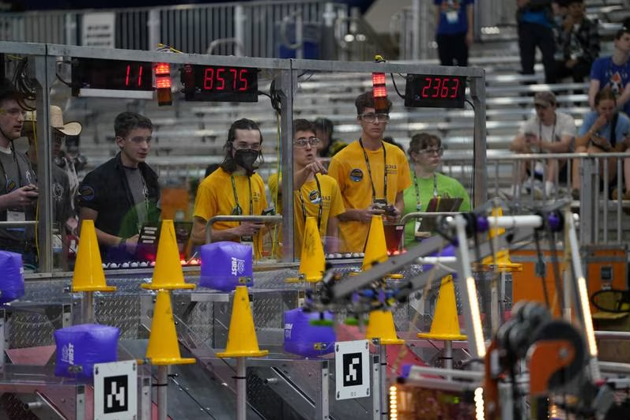
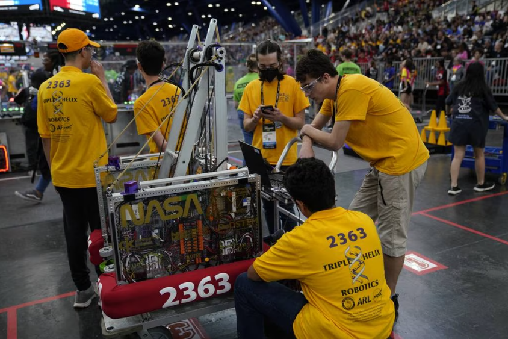
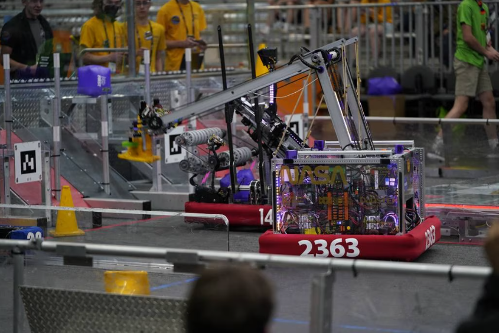

>## Next-level experience: Hampton Roads robotics team looks back on ‘most competitive’ season yet
>
>By Gavin Stone
>Daily Press
>May 7, 2023 at 11:08 am
>
>
>
>*Triple Helix team members operate their robot during a match in the 2023 FIRST Championship. (Todd Ferrante)*
>
>Things didn’t go quite their way at the world robotics championship in Houston, but for the team of Hampton Roads high school students, it’s not about winning.
>
>Triple Helix Robotics, a NASA-sponsored collection of students based out of Menchville High School in Newport News, competed in April’s FIRST Championship — which brings together more than 600 teams from 18 different countries to see whose robot is best. Qualifying for worlds has become part of the culture of Triple Helix in recent years, doing so roughly every other year, though this was only the second time they’ve attended the event since 2017.
>
>They wowed the judges despite their early elimination, taking home the Innovation and Control Award for their robot’s performance in the autonomous portion of the contest. They also earned awards for autonomous performance at four other competitions this season. Dating to last season, they’ve won seven straight regular-season competitions and have captured the district championship two years in a row.
>
>The level of skill in Houston was so high that no teams stood out from the pack, said Justin Babilino, a senior at York High School and the team captain.
>
>“To me, at the end of this one when we’re sitting there watching the final finals, you look at those robots and you can honestly say, ‘Yeah, we can do that,’” said Bill Bretton, who’s been a mentor for the team since 2015. “Previous years we got there and we have a good time and you make it so far but when you watch the finals they’re like ‘pro league’ … but this year we’re right up there and I think we could’ve swapped out for anybody in the finals and I think we could’ve held our own.”
>
>For volunteer head coach Nate Laverdure, the team has never been stronger.
>
>“Overall our competitiveness in the official season has just been over and above anything we’ve done before,” Laverdure said, adding that their ability to communicate what’s special about their robot to the judges was a major factor in their awards for autonomous functions.
>
>
>
>*Triple Helix team members work on their robot during the 2023 FIRST Championship in Houston. (Todd Ferrante)*
>
>According to Statbotics, a site that ranks FIRST Robotics Competition teams, Triple Helix is ranked 34th out of 3,294 teams and first out of 66 in Virginia.
>
>The expectation of success wasn’t built overnight. It grew over years of aggressive recruiting, bringing in middle school students who show a particular talent for robotics, Laverdure said. The use of the STEM Gym in Newport News, which allows robotics teams from across the region to work out the kinks in an open setting, has also helped Triple Helix reach new heights — especially with their autonomous routines.
>
>“If you look at our long-term success over the past few years I think one of the big things that was the difference was once we got the STEM Gym we started competing to a lot higher level,” Babilino said. “If you have a practice space to work out all those little issues with your robot then it just gives you such a huge competitive advantage.”
>
>Laverdure explained that at the championship in Houston, live competition only lasts about 20 minutes total — teams guide their robots to retrieve game pieces and balance on a platform while their opponents try to thwart them — so if you can practice for 20 hours ahead of time “you can totally dominate.”
>
>As much as the team wants to win, strengthening the robotics community takes an even higher priority. Many Triple Helix members are part of a Discord messaging forum where thousands of robotics competitors from around the world work out technical problems and share breakthroughs. All of Triple Helix’s software and much of their mechanical design is open source, meaning its freely available to distribute or modify, according to Laverdure.
>
>A team from Michigan uses Triple Helix’s software, and at least one other squad in their district uses it. But thousands of teams use a swerve joystick kinematic process designed by Triple Helix members, the coach said.
>
>“It feels so much better to kick butt on the playing field when you know that all the competitors also had access to all the same information,” said Laverdure.
>
>“It’s not like we’re not winning because we’re hiding something from people,” Babilino added, “and it really is great to help everyone do better and make the competition more fun in general.”
>
>Through Discord and other means, Josh Nichols, a homeschooled senior and the programming lead for the team, has made contributions to the work of many other teams by sharing his own research.
>
>“That’s really the great part of it is interacting with other teams because really we’re only so many people … but by interacting and working with thousands of teams from across the world online it allows you to develop so much more advanced technology,” Nichols said. “Regardless of the competition outcome, that’s the best part of the competition for me is the actual robot we develop and building something so much more complex and advanced because of this interaction with other people and sharing knowledge.”
>
>Britton saw the students overcome challenges both personal and technical over the course of the season. Quiet students became better leaders, inexperienced students learned new skills, and they had to be resourceful to fix problems during competition.
>
>Late in the district championship, the pivot point in their robot’s arm had begun to warp and sag, causing the chains to loosen on their sprockets. To fix it, they reinforced the arm by cutting up the aluminum legs from a three-legged camping stool someone had in their station and “jammed” it into the center of the arm, Britton said. They later added another piece of steel from Lowe’s.
>
>Those quick fixes were part of the robot throughout the world championship.
>
>“If somebody looked at it they’d never know that anything was different but we look at it and we go, ‘wow, that’s a pretty good fix that lasted’ — it’s just pretty neat. Resourceful,” Britton said.
>
>Britton noted the team’s resilience when, after a strong start in the district championship, they lost a round and had to fight their way out of the losers’ bracket.
>
>“I don’t think anybody said, ‘oh boy this is it’ — they didn’t, they just go, ‘Oh, so it’s just going to take longer,’” he said. “There was never that feeling like they were defeated.”
>
>
>
>*Triple Helix's robot, number 2363, carries a cone to their grid to score points in the 2023 FIRST Championship. (Todd Ferrante)*
>
>The world championship was also a recruiting ground for many of the top engineering companies and government agencies in the country. Nichols is currently doing an internship with NASA, where he is writing pathfinding algorithms to make robots follow a trajectory from point A to point B — which he said is “incredibly similar” to what he does in robotics competitions.
>
>Britton has seen firsthand the power of having participated in FIRST Robotics Competitions, saying it “opened doors” for both his children while other students were still trying to build their resumés. Employers value the experience with AutoCAD, fabrication, troubleshooting and firsthand knowledge the students gain.
>
>“Both of them had really great opportunities … They get jobs and assignments, projects in college simply because they have tons of experience that their peers don’t have,” Britton said. “If you didn’t do (the robotics competitions) you could completely go through a four-year degree and not do any of that.”
>
>“It surprises me that (robotics teams) aren’t everywhere,” he continued, “I don’t know why every school doesn’t have a team because the way things are so focused on technology and STEM — this is the fast track to get you there.”
>
>*Gavin Stone, 757-712-4806, gavin.stone@virginiamedia.com*
