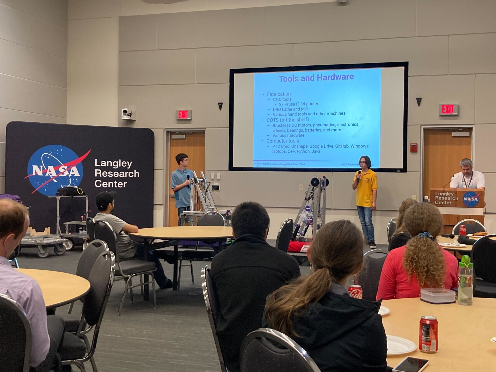

*Recent Triple Helix graduates Joshua N. and Justin B. present to NASA Langley Research Center employees at a recent Lunch & Learn event organized by the Center's two "house FRC teams" NASA Knights and Triple Helix.*

**New faces**
Over the last couple months we have welcomed several new students and adults who have checked out the team and shared in our projects. If you've been thinking about getting more involved, now is a great time to drop by and check out what we're all about! The team is continuing to meet year-round, and so far this summer we have been investigating new drivetrain packaging, testing and repairing various electronics, doing training activities, participating in outreach and service events, collaborating with other teams, and more. Keep watching our meeting schedule at [calendar.team2363.org](http://calendar.team2363.org/) to learn about opportunities to meet the team.

**Good luck to our new alumni!**
Last month, Triple Helix graduated two stellar senior students. As we move into the fall, we'd like to share our best wishes for these new alumni on their next adventures!

**My retirement as head coach**
I have decided to step down as the head coach of Triple Helix. I have thoroughly enjoyed my time as the team's main leader and I'm extremely proud of what we've accomplished together:

- We founded the Rumble in the Roads, an offseason FRC tournament that places the energy and impact of competitive youth robotics right in a spot where it's impossible for our fellow students, coworkers, neighbors, and friends NOT to see it and get inspired by it!

- We founded the Peninsula STEM Gym, a community practice space for competitive robotics, the only space of its kind within 300 miles.

- We kept the team competitive through various evolutions of the FRC program, including the switch to district play, the retirement of "bag and tag", endless changes to the cost accounting rules, etc.

- We kept the team intact, and serving as a healthy escape, through the massive disruption of the global pandemic.

- We maintained an outstanding on-field performance-- 2x winners of the FIRST Chesapeake District Championship, 5x qualified for the FIRST Championship, 3x invited to the prestigious Indiana Robotics Invitational, and over 30 trophies/medals/banners in official play over the last 8 seasons.

I owe a great deal of thanks to everyone who has contributed to these shared successes, especially my predecessor Matt Wilbur who crafted so many of the essential building blocks that Triple Helix has relied on.

I plan to continue serving as President of Intentional Innovation Foundation, the 501c3 nonprofit we founded in 2015 to organize a collection of youth STEM outreach efforts in Hampton Roads, but I will not be involved in day-to-day mentoring of the team. I continue to believe that FIRST and Triple Helix represent unparalleled opportunities for students, and will do what I can to stay involved in both while exploring other personal opportunities.

**Please offer your support to the team's new leadership**
A group of three core mentors has stepped forward with the goal of keeping Triple Helix's doors open-- and maintaining it as a space where students can have transformative experiences in STEM. I have no doubt that, while there will be challenges, this group of mentors can succeed as long as they have your patience, appreciation, and support.

You can reach the Triple Helix leadership team at [contact@team2363.org](mailto:contact@team2363.org).

**Save the date - Rumble 8 - The Ocho**
The 8th annual [Rumble in the Roads](https://www.rumbleintheroads.com/), Hampton Roads' unofficial offseason FRC tournament, is scheduled for Saturday, October 28, 2023 at Heritage High School in Newport News. Triple Helix is proud to help organize this event along with partners Blackwater Robotics and the NASA Knights.  The volunteer registration for the event will open later this summer; stay tuned for more information!

--  
Nate Laverdure  
President, Intentional Innovation Foundation  
Former head coach, Triple Helix Robotics
