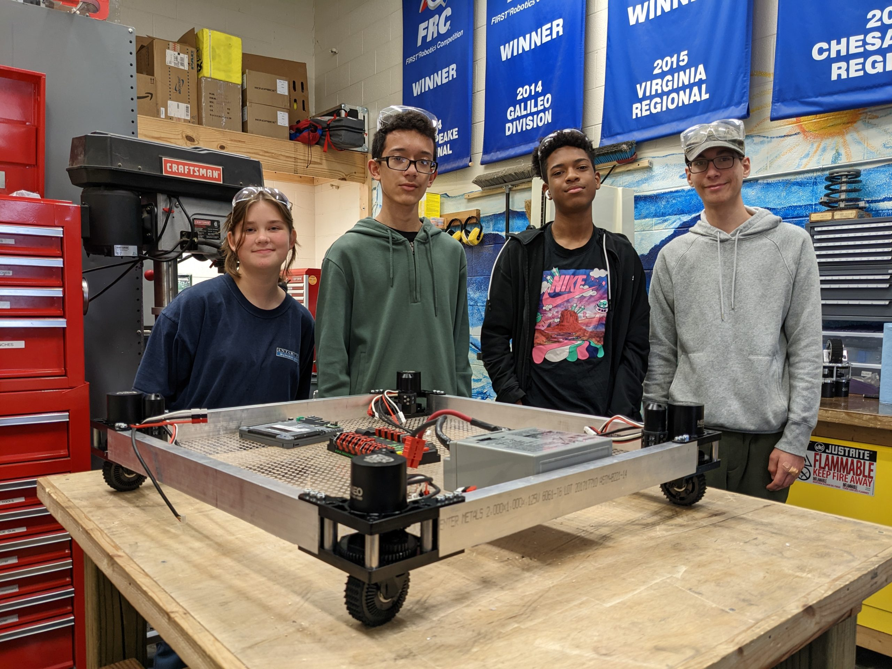
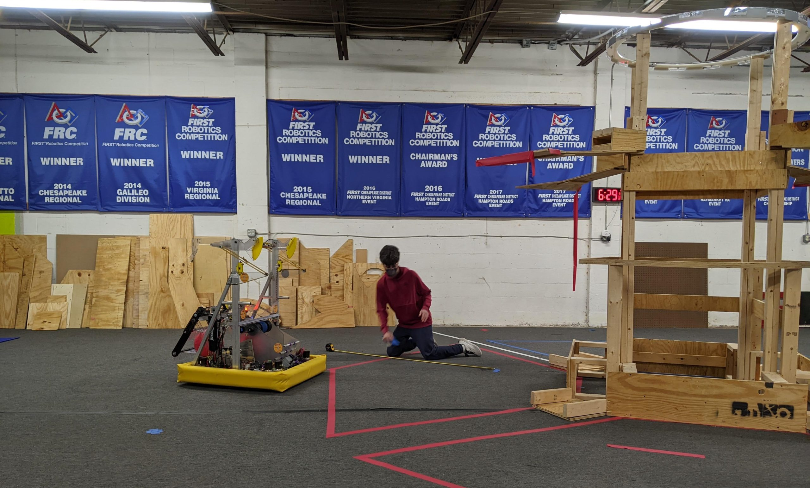
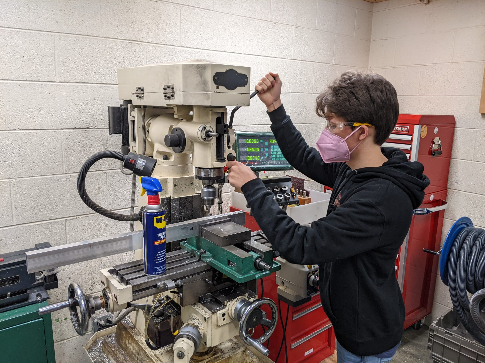

Award-winning high school robotics team Triple Helix Robotics is seeking a new workspace on the Peninsula.

Based at Menchville High School in Newport News since 2007, the volunteer-led team has leveraged the high-energy challenge of the [FIRST Robotics Competition](https://www.youtube.com/watch?v=Jd29kzjclV0) (FRC) to deliver life-changing STEM experiences to the region’s students for over 16 years.

As a result of changing security postures following the gun violence that occurred in and around Newport News schools last school year, the school district has adopted a set of risk mitigation policies. As an unfortunate consequence, volunteer access to the Triple Helix workshop has been tightly restricted, making the team’s continued operation from the high school impracticable. A workable solution to maintain the relationship could not be found even after lengthy discussion.

FRC is a high school sport just like any other, aside from two key differences: (1) our student athletes practice in a machine shop rather than on a court, and (2) all of our players can "go pro," [entering the STEM degree programs and careers](https://www.firstinspires.org/about/impact) that will cement them as leaders of the Hampton Roads knowledge economy for the next generation. Last season, Triple Helix [ranked in the top 1% of teams worldwide](https://www.statbotics.io/team/2363/2023), was [recognized by the NNPS school board](https://www.youtube.com/watch?v=FYBgMqHrBYo), and appeared [in the local press](https://team2363.org/topics/publicity/) alongside [our government, corporate, and community sponsors](https://team2363.org/partners/).

Triple Helix’s success in reaching our young people has, since its founding, attracted and sustained the engagement of major sponsors, bringing in over $800,000 of community investment over the last eight years. Our high-tech machine sport also attracts the volunteerism of local industry professionals, who not only share tangible STEM skills with our students, but also impart a real understanding of what a rewarding STEM career will look and feel like. The FIRST Robotics Competition program also makes our students fluent with professional-grade tools and software that are far more likely to be found in small engineering firms than in a classroom.

Because of our stakeholders’ continued belief in the importance of the Triple Helix program, we are looking for a new home for the team. The team requires approximately 650 sqft of machine shop, assembly, and storage space (currently donated), as well as about 2400 sqft of practice field space (currently rented at $900/mo). Access to power, internet, and bathrooms is required. The team’s normal hours are weekdays 6-9pm and weekends 9am - 6pm, although off-hours access is occasionally needed as well. The team’s nonprofit sponsor, [Intentional Innovation Foundation](https://www.iifound.org/), maintains liability insurance. Triple Helix’s volunteer mentors pass multiple background checks through their employers as well as the FIRST Youth Protection Program.

To offer a suggestion of a new workspace for the team, or to request more information, please contact Triple Helix at [contact@team2363.org](mailto:contact@team2363.org).
